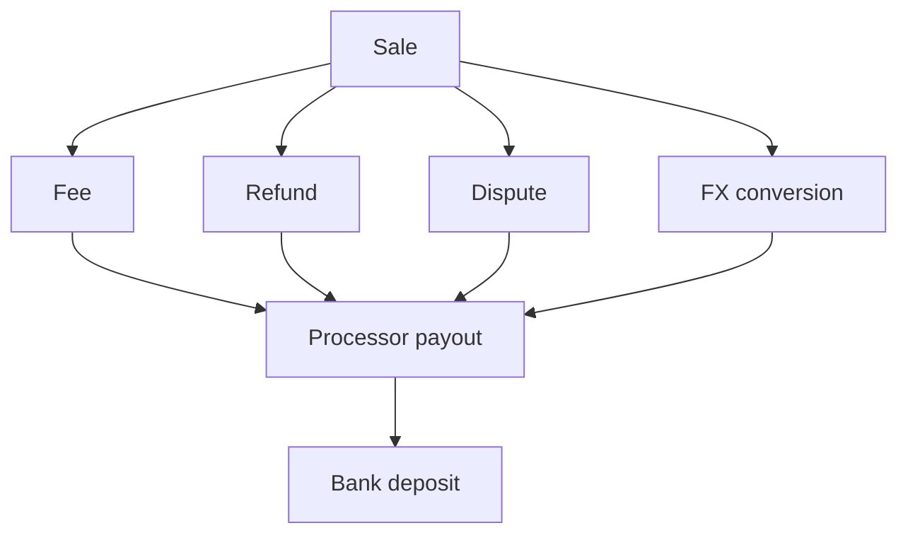

# DriftRecon

Live app: [https://driftrecon.onrender.com](https://driftrecon.onrender.com)

Stripe, Gumroad, Dodo, and the bank do not share one record. A June Stripe sale can refund in July. A EUR sale can settle as USD. Several sales can land in one payout. A payout can fail to match the deposit.

DriftRecon imports those CSVs into one ledger, traces each sale through fees, refunds, disputes, and FX to the processor payout and the bank deposit, then asks a human only when the match is uncertain. Code calculates. The Recon Agent investigates. A human decides.

## For judges

The check is the live app. Download these CSVs, drop them on Overview, click **Run**:

- [data/stripe.csv](data/stripe.csv)
- [data/gumroad.csv](data/gumroad.csv)
- [data/bank.csv](data/bank.csv)
- [data/dodo.csv](data/dodo.csv)
- [data/ground-truth.csv](data/ground-truth.csv) — Evaluation only, never used during matching

Graph, Review, and Evaluation use that same import. There is no in-app sample button.

## What it does

Amounts stay in integer minor units (`$10.50` is `1050`). Invalid rows are stored, not dropped. Imported amounts are never rewritten.

Matching order is fixed:

1. Exact external / parent / payout references (confidence `1.00`)
2. Human-approved policies
3. Structured score: `reference × 0.40 + amount × 0.25 + timing × 0.15 + currency × 0.10 + metadata × 0.10`

Payout math is TypeScript only:

```text
Σ sales − Σ refunds − Σ disputes − Σ fees ± Σ FX = processor payout
processor payout ≈ bank deposit   (demo tolerance 1 cent)
```

| Confidence | Result |
| ---: | --- |
| `≥ 0.95` | Auto-match only if payout invariants pass |
| `0.70 – 0.9499` | Review queue |
| `< 0.70` | Unresolved |

The Recon Agent can inspect events and tool results. It cannot change amounts, invent rows, override a failed invariant, or approve its own case. Approve on Review writes a constrained policy. The next run applies that policy before scoring.



## Sponsors

| Sponsor | How DriftRecon uses it |
| --- | --- |
| [Stripe](https://stripe.com) | Sale, fee, refund, dispute, FX, and payout rows from `stripe.csv` |
| [Dodo Payments](https://dodopayments.com) | The same kinds of rows from `dodo.csv`, plus a live webhook at `POST /api/webhooks/dodo` |
| [Gumroad](https://gumroad.com) | Sale, fee, and payout rows from `gumroad.csv` |
| [Chase](https://www.chase.com) / bank export | Deposit rows from `bank.csv`, matched to processor payouts |
| [Neon](https://neon.tech) | Postgres for the ledger, graph, exceptions, and policies |
| [TensorMux](https://tensormux.com) | Optional Recon Agent inference. Missing key still runs the deterministic tools |
| [Neatlogs](https://neatlogs.com) | Optional traces of agent tool calls |

## Required learning case

June Stripe sale `+$1000`. July refund `−$200`. First run raises a cross-period exception. A human approves. A refund policy is stored. The next run attaches the same pattern automatically.

## Setup

The live app is already running. To run a copy: Node 20+, Neon project **DriftRecon**, and `.env.local` with secrets only. Host, database, role, TensorMux URL, and Neatlogs URL live in `lib/config.ts`.

```
NEON_PASSWORD=
TENSORMUX_API_KEY=
NEATLOGS_API_KEY=
```

Health: [https://driftrecon.onrender.com/api/health](https://driftrecon.onrender.com/api/health)
