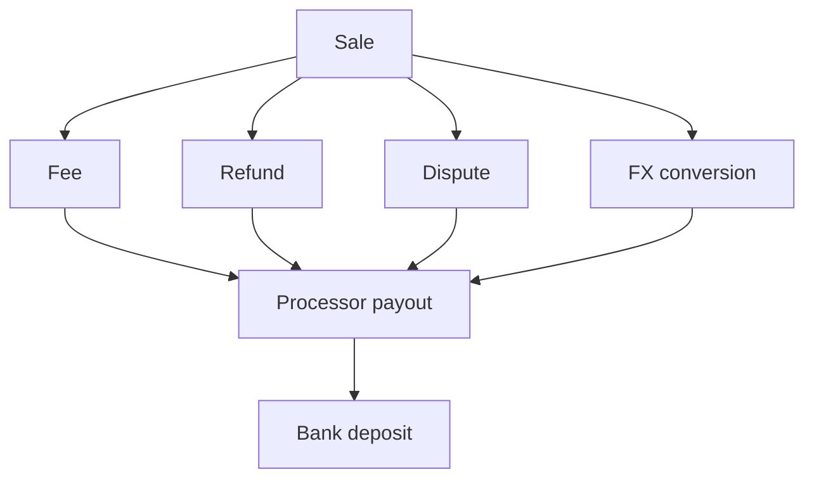
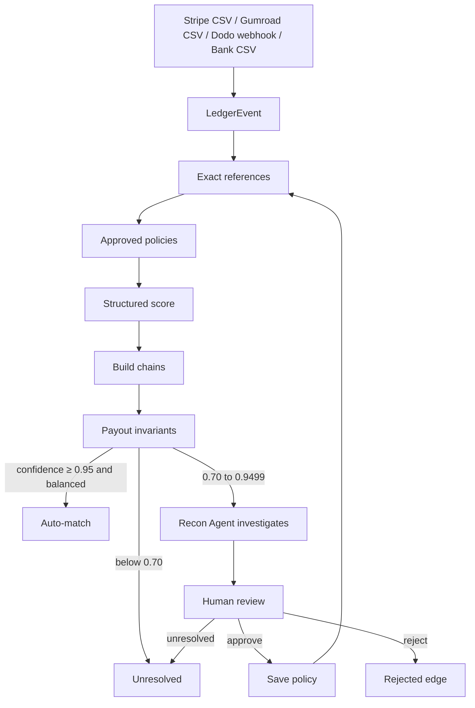
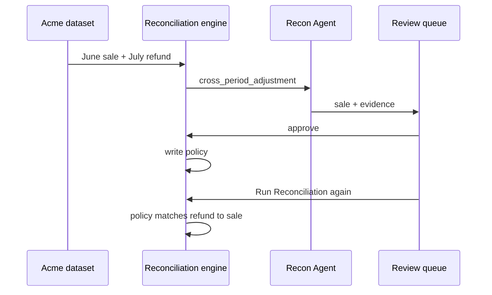

# DriftRecon

Reconciles Stripe, Gumroad, Dodo, and bank activity into one ledger, then traces each sale through fees, refunds, disputes, and FX to the processor payout and the bank deposit.

Live app: [https://driftrecon.onrender.com](https://driftrecon.onrender.com)

Autonomous Office of the CFO. Core rule: code calculates, the Recon Agent investigates exceptions, a human decides anything uncertain.

## What it does

Payment platforms and the bank do not share one record. A June Stripe sale can refund in July. A EUR sale can settle as USD. Several sales can land in one payout. A payout can fail to match the deposit.

DriftRecon imports those rows into one `LedgerEvent` model. Amounts stay in integer minor units (`$10.50` is `1050`). Invalid CSV or webhook rows are stored, not dropped. Imported amounts are never rewritten.

The engine then builds a graph of relationships: `belongs_to`, `refunds`, `disputes`, `settles_into`, `converts_into`, `deposited_as`. Related events stay linked across accounting periods.

Matching order is fixed:

1. Exact external / parent / payout references (confidence `1.00`)
2. Human-approved policies
3. Structured score

```text
reference × 0.40 + amount × 0.25 + timing × 0.15 + currency × 0.10 + metadata × 0.10
```

Payout math is TypeScript only:

```text
Σ sales − Σ refunds − Σ disputes − Σ fees ± Σ FX = processor payout
processor payout ≈ bank deposit   (demo tolerance 1 cent)
```

Confidence gates:

| Confidence | Result |
| ---: | --- |
| `≥ 0.95` | Auto-match only if payout invariants pass |
| `0.70 – 0.9499` | Review queue |
| `< 0.70` | Unresolved |

The Recon Agent can inspect events, candidates, policies, and deterministic tool results (`get_event`, `find_events`, `calculate_chain`, `validate_payout`, `propose_match`, `request_human_review`). It cannot change amounts, invent rows, override a failed invariant, or approve its own case. TensorMux is optional inference. Missing keys still run the deterministic tools. Invalid TensorMux JSON is an execution error.

Approve on Review creates a constrained policy. The next run applies that policy before structured scoring. Evaluation scores this run against held-out ground truth and a same-period baseline (amount, currency, date; no graph, agent, or policies).

## Money chain



## Pipeline



## Required learning case

June Stripe sale `+$1000`. July refund `−$200`. First run raises a cross-period exception. The agent finds the sale and shows evidence. A human approves. A refund policy is stored. The next run attaches the same pattern automatically and records the policy ID on the edge.



## Screens

| Route | What you see |
| --- | --- |
| Landing `/` | Hero + **Launch app** |
| Overview `/dashboard` | Totals, exceptions, imported rows, **Run Reconciliation** |
| Graph `/graph` | Sale-to-bank graph (React Flow) |
| Review `/review` | Agent evidence. Approve, reject, or leave unresolved |
| Evaluation `/evaluation` | Precision, recall, payout coverage, residuals, false auto-matches vs baseline |

## Setup

Needs Node 20 and a Neon Postgres database (project **DriftRecon**).

Create `.env.local` with secrets only. TensorMux URL, model, and Neatlogs URL stay in `lib/config.ts`.

```bash
NEON_PASSWORD=
TENSORMUX_API_KEY=
NEATLOGS_API_KEY=
```

`NEON_PASSWORD` is the Neon role password. Host, database, and role live in `lib/config.ts`. The two API keys are optional.

```bash
npm install
npm test
npm run dev
```

`npm run dev` starts the Next.js app. Open the landing page, click **Launch app**, then Overview → Graph → Review → Evaluation.

### Render

Service: [https://driftrecon.onrender.com](https://driftrecon.onrender.com)

Set only:

- `NEON_PASSWORD`
- `TENSORMUX_API_KEY`
- `NEATLOGS_API_KEY`

Do not set `TENSORMUX_MODEL`, `TENSORMUX_BASE_URL`, or `NEATLOGS_ENDPOINT`.

Health: [https://driftrecon.onrender.com/api/health](https://driftrecon.onrender.com/api/health)

Dodo webhook: `POST /api/webhooks/dodo`

## Commands

```bash
npm install
npm test
npm run dev
npm run build
npm start
```

## Dataset

`data/` holds Acme Creator Co.: `stripe.csv`, `gumroad.csv`, `bank.csv`, `dodo-events.json`, `ground-truth.json`. Ground truth is used on Evaluation only, never during matching.
